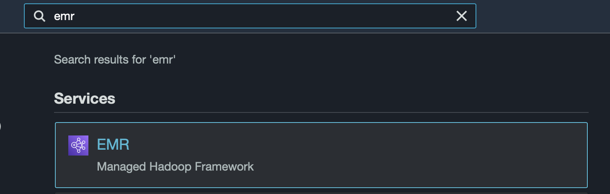
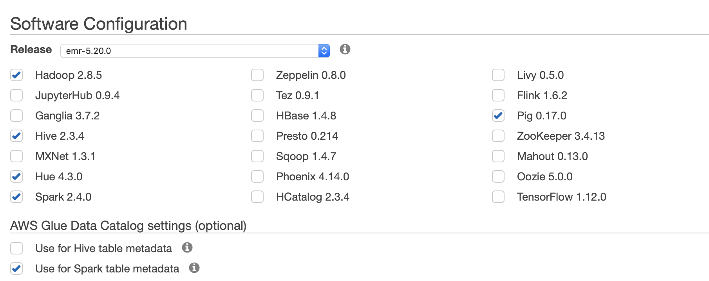
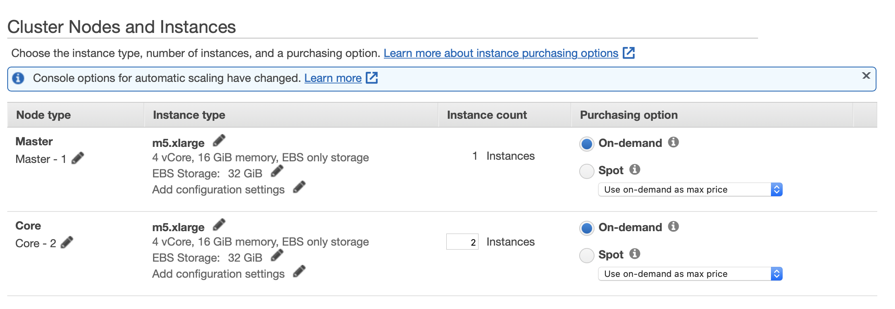

# Sparkify Churn prediction

This project is part of Udacity course.
\
**Data**: Set of user events from music App, which include info about songs and artist listened, account status (free/paid), registration date, etc. 
\
**Objective**: Predict churn. We consider user to be churned if we see cancellation of subscription.

For simplicity, we run EDA and pipeline validation with a small subset (128 MB) and then run pipeline with a full dataset (12GB) on AWS cluster to get the final state of the model. 

Read [medium post](https://daria-satco.medium.com/5-steps-to-build-a-churn-prediction-model-with-pyspark-ml-b62ff1e00de6) to find more details on the modelling approach and results.

### Requirements
```
pandas==1.1.5
numpy==1.19.5
pyspark==2.4.3
sweetviz==2.1.3
```

## How to launch Jupyter Notebook with Spark cluster on AWS
1. Sign in to [AWS](https://aws.amazon.com) console
2. Search "EMR" service:

3. Go to Clusters --> Create cluster
4. Go to Advanced Options:
    * Software and Steps:
    
    * Hardware
    
   For remaining default parameters can be used
5. Create cluster.
6. Go to Notebooks --> Create notebook:
    * Choose cluster which you've just created
    * AWS service role == EMR_Notebooks_DefaultRole
    * Choose S3 space where to save Notebook

That's it! As soon as you start cluster and notebook, Amazon will start charging you, because EMR is not included in Free Tier services. 

## Read full dataset within AWS Jupyter Notebook
```python
from pyspark.sql import SparkSession

# Create spark session
spark = SparkSession \
    .builder \
    .appName("Sparkify") \
    .getOrCreate()

# Read full sparkify dataset
event_data = "s3n://udacity-dsnd/sparkify/sparkify_event_data.json"
df = spark.read.json(event_data)
df.head()
```

## Structure of the project
* data: includes small subset `mini_sparkify_event_data.json` in ZIP format
* EDA_reports: contains HTML reports from sample data and churn vs stayed users generated with `sweetviz` package
* saved_models: dummy folder to put pretrained models
* readme_imgs: images used in readme file
* Sparkify_subset.ipynb: Jupyter Notebook with the pipeline run on a subset data
* Sparkify_full.ipynb: Jupyter Notebook from AWS cluster, which includes only main pipeline and outcomes based on full dataset